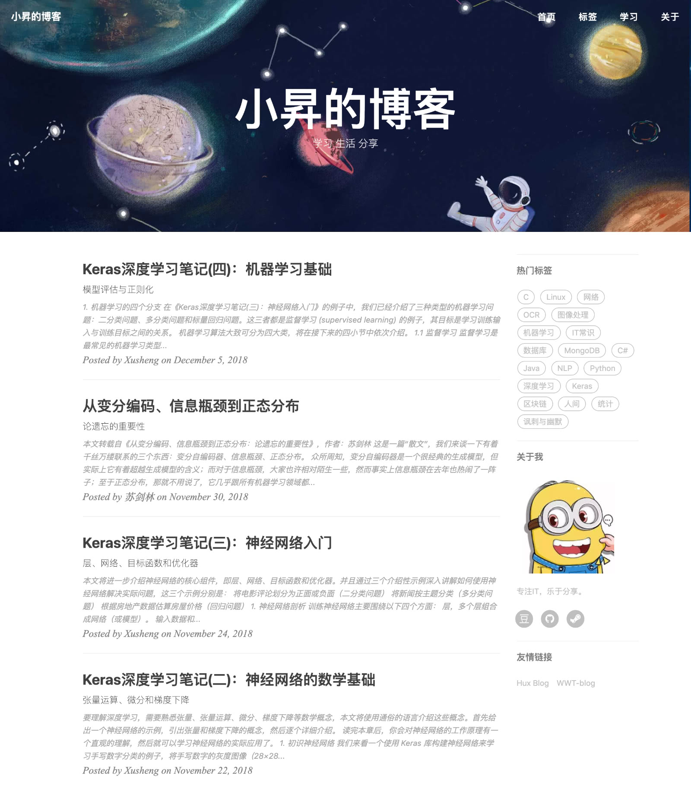

# Valuebai | Blog
这是一个 jekyll 的主题模板，主要适用于搭建个人博客使用。模板修改自 [huxblog-boilerplate](https://github.com/Huxpro/huxblog-boilerplate) 主题，原作者为 [黄玄](http://huangxuan.me/)。

[我的博客](https://valuebai.github.io/)就使用了该模板，效果如下：

- 你可以访问 **[这里](https://jsksxs360.github.io/xs-huxblog/)** 预览该主题。
- 关于如何使用该主题，请点击查看 **[说明文档](https://github.com/jsksxs360/xs-huxblog/blob/master/Document.md)** 。
- [**下载**](https://github.com/jsksxs360/xs-huxblog/archive/master.zip)本主题。

如果你喜欢该主题，请在原作者黄玄的 [huxpro.github.io](https://github.com/Huxpro/huxpro.github.io) 上点个赞（右上角 star 一下）。当然，若你能顺带给我的这个项目点个赞，那就更好了。

## 碰到加载css, js出现404
- 需要添加文件CNAME，里面只填写你的域名或者网站名，如：https://valuebai.github.io/

## 每篇文章的格式
- 文章存放：_post文件夹
- 文章前面统一的格式
- 文章显示：按照时间排序
---
layout:     post					# 使用的布局（不需要改）
title:      2019-11-23-NLP-测试		# 标题，前面没有像2019-09-09的时间，github是不会显示这篇文章的
subtitle:   填写副标题    			#副标题
date:       2019-11-23
author:     Valuebai
header-img: img/back-gunicorn.jpg 	#这篇文章标题背景图片
catalog: true
tags:
    - 机器学习
    - 深度学习
    - 自然语言处理
---